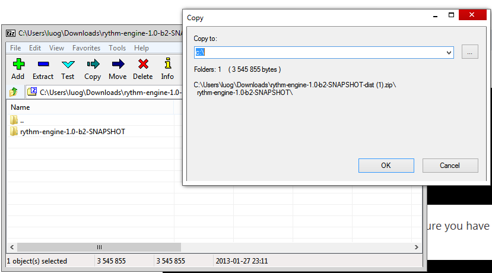
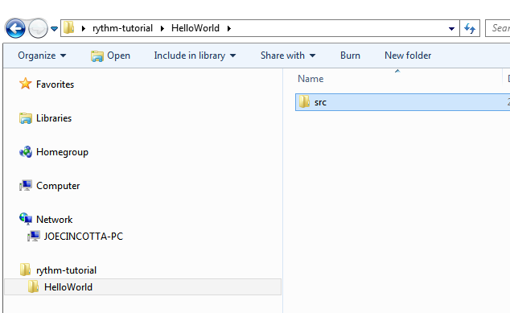
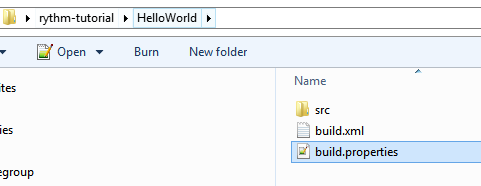
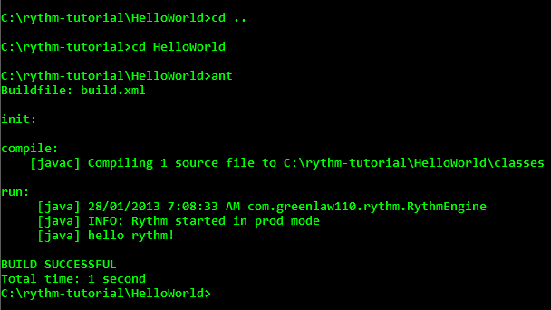

# 教程

### [evn]环境设置

本节说明如何设置Rythm所需的开发环境。首先确保你的机器上安装好了以下软件：

1. Java, JRE or JDK 1.6+

    
    
    <a href="http://www.oracle.com/technetwork/java/javase/downloads/index.html">
    <i class="icon-download">&nbsp;</i><span>下载Java开发包或者运行包</span>
    </a>

1. Ant 1.7+

    
    
    <a href="http://ant.apache.org/">
    <i class="icon-download">&nbsp;</i><span>下载Ant</span>
    </a>

1. Maven 2 或 Maven 3 （注：Ant和Maven可选其一）

    
    
    <a href="http://maven.apache.org/">
    <i class="icon-download">&nbsp;</i><span>下载Maven</span>
    </a>
    
1. Rythm. 参照[文档说明](/doc/index#get) 下载最新的Rythm发行包并解压到你的本地目录，比如 `C:\`

    

### [hello]Hello world!

好了，让我们开始旅程的第一步：使用Rythm向世界问好吧

1. 创建一个项目文件夹“HelloWorld”，然后在里面创建一个 `src` 文件夹：

    
    
1. 在项目文件夹中加入 `build.xml` 文件：

    
   
   然后拷贝[github版本](https://github.com/greenlaw110/Rythm/blob/1.0/samples/HelloWorld/build.xml)的内容到你创建的 `build.xml` 文件中：
    
1. 在项目文件夹中加入 `build.properties` 文件：

    
    
   并将以下内容添加到此文件中：
    
    ```properties
    src=src
    lib=lib
    classes=classes
    
    # 改变下面的设置，确保其指向你解压的rythm运行目录
    rythm.home=c:\\rythm-engine-1.0-b6-SNAPSHOT
    rythm.lib=${rythm.home}/lib
    ```

1. 在 `src` 文件夹中创建一个名叫 `HelloWorld.java` 源文件：

    
    
   在其中加入以下内容：
    
    ```java
    import org.rythmengine.Rythm;

    public class HelloWorld {
        public static void main(String[] args) {
            System.out.println(Rythm.render("hello @who!", "rythm"));
        }
    }
    ```

1. 好了，现在来运行一下：

    
    
   很好，只是我们想说 `Hello World!` 而不是 `hello rythm!`。我们需要回到Java源代码做一点小小的改变，将下一面一句
    
    ```java
    System.out.println(Rythm.render("hello @who!", "rythm"));
    ````
    
    变为
    
    ```java
    System.out.println(Rythm.render("Hello @who!", "World"));
    ```
    
    再重新运行一遍：
    
    
    
    嗯，这就是我们想要的了
    
    现在来点有趣的，将程序中内嵌的模版内容分离到单独的模版文件中，同时把简单文本换成html文件。按照Java的标准做法，在 `resources` 文件夹中创建一个模版文件：
    
    
    
    并将以下内容添加到这个 `helloworld.html` 文件中：
    
    ```html
    @args String who
    <html>
    <head>
    <title>Hello world from Rythm</title>
    </head>
    <body>
    <h1>Hello @who</h1>
    </body>
    </html>
    ```

    完成以上步骤之后回到Java代码，将下面语句做点改变，让Rythm从外部模版文件读取内容：
    
    ```java
    System.out.println(Rythm.render("Hello @who!", "World"));
    ```
    
    改为
    
    ```java
    System.out.println(Rythm.render("helloworld.html", "World"));
    ```
    
    运行程序看看我们能得到什么：
    
    
    
    咦不对，这不是我们想要的。Rythm原样输出了模版名字，而不是需要生成的内容。这是因为Rythm没有找到一个叫做  `helloworld.html` 的文件。因为我们还没有告诉Rythm在哪里去找模版文件。Rythm有两种方式可以让来定位模版文件：
    
    1. 设置 `home.template` 配置项。在调用Rythm的 `render` API之前需要配置Rythm，让其知道模版文件的home目录在哪里。

    1. 将模版文件放置进Java的class path
     
    先按照 `home.template` 方式来。将 `HelloWorld.java` 文件改为：
    
    ```java
    import java.util.*;
    import org.rythmengine.Rythm;
     
    public class HelloWorld {
        public static void main(String[] args) {
            // use Map to store the configuration
            Map<String, Object> map = new HashMap<String, Object>();
            // tell rythm where to find the template files
            map.put("home.template", "resources");
            // init Rythm with our predefined configuration
            Rythm.init(map);
            System.out.println(Rythm.render("helloworld.html", "World"));
        }
    }
    ```

    好开始运行：

    
    
    现在结果正常了。
    
    下面试一试class path方式。先把 `HelloWorld.java` 变回原来的样子，或者注释掉刚刚加入的语句：
    
    ```java
    import java.util.*;
    import org.rythmengine.Rythm;
        
    public class HelloWorld {
        public static void main(String[] args) {
            // use Map to store the configuration
            //Map<String, Object> map = new HashMap<String, Object>();
            // tell rythm where to find the template files
            //map.put("home.template", "resources");
            // init Rythm with our predefined configuration
            //Rythm.init(map);
            System.out.println(Rythm.render("helloworld.html", "World"));
        }
    }
    ```

    还需在 `build.xml` 做一点改变，保证模版文件被拷贝进 `classes` 目录（在运行时的class path中）。在文件的 `init` 目标（target）中加入以下语句，注意在 `</target>` 之前加入。
    
    ```html
    <copy file="resources/helloworld.html" todir="${classes}"/>
    ```
    
    加完后你的 `target` 应该是这样的：
    
    ```xml
    <target name="init">
        <tstamp/>
        <mkdir dir="${classes}"/>
        <copy file="resources/helloworld.html" todir="${classes}"/>
    </target>
    ```

    再运行程序你应该得到相同的结果
    
    现在总结以下刚刚学到的：
    
    1. 使用 `Rythm.render()` API让Rythm引擎处理模版和参数并返回生成结果
    2. 传进 `Rythm.render` 的第一个变量指定模版内容，它可以是内联模版内容（比如 `Hello @who!`），也可以使一个外表模版文件路径（如 `helloworld.html`）。
    3. 在第一个模版变量之后传递模版参数。
    
    现在我们对 `HelloWorld` 项目加一个小需求，让模版不仅能说“Hello”，而当用户需要改变时也能说其他的谓词，比如“Greeting”。首先将 `helloworld.html` 模版文件从：
    
    ```html
    @args String who
    ...
    <h1>Hello @who</h1>
    ```
    
    改为
    
    ```html
    @args String action, String who
    ...
    <h1>@action @who</h1>
    ``` 
    
    这个改变意味着我们没有将“Hello”这个谓词硬编码在程序中，而是通过一个模版参数 `@action` 来输出用户指定的谓词。下面在Java源码中做改变，将下面的内容：
    
    ```java
    System.out.println(Rythm.render("helloworld.html", "World"));
    ```
    
    改为 
    
    ```java
    System.out.println(Rythm.render("helloworld.html", "World", "Greeting"));
    ```
    
    运行程序我们得到：
    
    
    
    这里我们发现一个问题，本意是想说“Greeting World”，结果是“World Greeting”。这是由于模版参数`@action` 在 `@who` 之前申明。在 `HelloWorld.java` 程序中交换“World”和“Greeting”的位置可以修复这个问题。这很简单，不过当一个模版参数多了的话，记住每个参数的位置是很麻烦的，好在Rythm支持按照名字来传递模版参数，如下所示：
    
    ```java
    import java.util.*;
    import org.rythmengine.Rythm;
        
    public class HelloWorld {
        public static void main(String[] args) {
            Map<String, Object> params = new HashMap<String, Object>(2);
            params.put("who", "World");
            params.put("action", "Greeting");
            System.out.println(Rythm.render("helloworld.html", params));
        }
    }
    ```

    将上述代码替换 `HelloWorld.java` 文件的内容之后再运行程序可以得到正确的结果：
    
    
    
    如果感觉用 `Map` 填充参数的过程很冗长的话，Rythm提供了一个工具类 `NamedParameter` 来简化这个过程：
    
    ```java
    import java.util.*;
    import org.rythmengine.Rythm;
    import org.rythmengine.utils.*;
        
    public class HelloWorld {
        public static void main(String[] args) {
            NamedParams np = NamedParams.instance;
            System.out.println(
                Rythm.render("helloworld.html", 
                    np.from(
                        np.pair("who", "World"), 
                        np.pair("action", "Greeting"))));
        }
    }
    ```
    
    在结束 `HelloWorld` 项目之前，我们最后学习一下关于Rythm的特殊符号 `@` 的一点知识。如果一个模版中有电子邮件的时候，邮件地址中的 `@` 会被Rythm如何理解呢。四川有句话叫“告才晓得”，意思是试一试就知道了。我们改一下模版文件，在其中加入一个电子邮件地址：
    
    ```html
    @args String who, String action
    <html>
    <head>
    <title>Hello world from Rythm</title>
    </head>
    <body>
    <h1>@action @who</h1>
    <p>Please contact me at green@rythmengine.com</p>
    </body>
    </html>
    ```

    运行程序得到以下错误：
    
    
    
    嗯，正如所想，Rythm引擎把邮件host部分当做了表达式来对待。要解决这个问题，在邮件中的 `@` 之前再加一个 `@` ，即将邮件地址写作 `green@@rythmengine.com` 。改完之后重新运行程序可以得到希望的结果：
    
    
    
    现在是到了结束 `HelloWorld` 项目的时候了。我们从这个项目中学到了一下知识点：
    
    1. 使用 `Rythm.render()` API让Rythm引擎处理模版和参数并返回生成结果
    1. 传进 `Rythm.render` 的第一个变量指定模版内容，它可以是内联模版内容（比如 `Hello @who!`），也可以使一个外表模版文件路径（如 `helloworld.html`）。
    1. 在第一个模版变量之后传递模版参数。
    1. `Rythm.render()` 可以接受按照申明位置传递模版参数，也可以接受使用 `Map<String, Object>` 来按照名字传递参数。
    1. 如果需要在模版运行结果中显示 `@` 符号的话，用 `@@` 来转码。
    
    下一步我们将开始更加有趣的旅程……

### [bookstore]公爵书店

休息一下，马上回来
